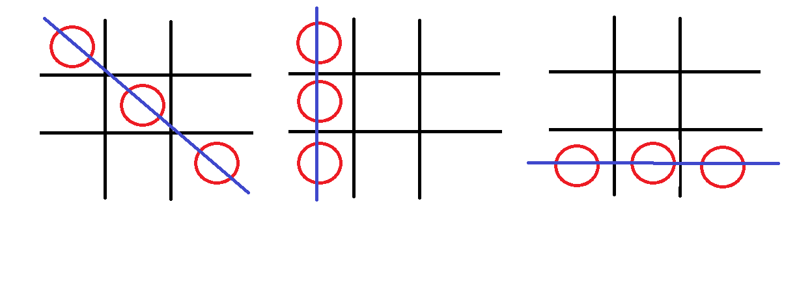
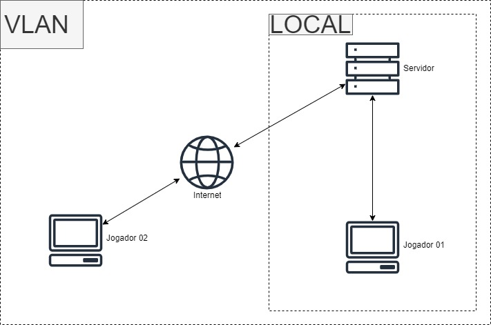

# Jogo da Velha RMI em Java

## Descrição do Jogo

É a recriação do clássico jogo da velha, onde temos o jogador **1** que é a **bolinha** e o jogador **2** que é a **cruz** dentro de um tabuleiro de tralha.

### Condição de vitória

Ganha o jogador que conseguir fazer 3 do seu simbolo em linha reta, segue algumas imagens para exemplificar.



### Jogadas Válidas ou Inválidas

A jogada só vai ser válida se a posição que o jogador escolher estiver vazia, senão a jogada se torna inválida. 


---

## Arquitetura utilizada na implementação.

A imagem a seguir é como o jogo foi iniciado [nesse video mostrando o projeto](), mas a sua arquitetura também permite que também somente jogadores locais joguem ou somente dentro da VLAN, sendo uma arquiterura Cliente-Servidor normal.



---


## Como foi estruturada a solução do sistema distribuído.

A linguagem de programação utilizada foi o Java, se utilizando do RMI como mecanismo utilizado para garantiar a transparência na comunicação dentro de um sistema distribuído, os mecanismos do RMI que ajudaram na construção do jogo foram:

**Chamada de Métodos Remoto**: RMI permite que um programa Java em uma JVM chame métodos de objetos localizados em uma JVM remota. Isso é feito de forma transparente, como se o objeto remoto estivesse local.

>Assim como em:

```java
	private static void painelJogo() throws Exception {
		try {
			JFrame frame = new JFrame();
			
			JPanel painel = new PainelDoJogo();
			frame.setContentPane(painel);
			
			frame.setDefaultCloseOperation(JFrame.EXIT_ON_CLOSE);
			frame.setSize(500, 500);
			frame.setResizable(false);
			frame.setVisible(true);

		} catch (RemoteException e) {
			throw new CustomException("Erro no objeto remoto");
		}
	}
```
Caminho no código

```
\jogo-da-velha-rmi-java\src\jogo\rmi\Client.java
```


**Interfaces Java**: RMI baseia-se fortemente em interfaces Java. Para expor um objeto para acesso remoto, você define uma interface que estende a interface especial *Remote*. Todos os métodos que podem ser chamados remotamente devem ser declarados na interface remota.

>Assim como em:

```java
public interface IControladorJogoVelha extends Remote {

	public void restart() throws RemoteException;

	public void usuarioClicou(int idJogador, int indexLinha, int indexColuna) throws RemoteException;
	
	public boolean temCirculo(int indexLinha, int indexColuna) throws RemoteException;
	
	public boolean temXis(int indexLinha, int indexColuna) throws RemoteException;

	public int getVitoriasXis() throws RemoteException;

	public int getVitoriasCirculo() throws RemoteException;

	void teste() throws RemoteException;
	
	// Cria um identificador para o jogador conectado
    public int criarIdJogador() throws RemoteException;
    
    public Jogador getJogador() throws RemoteException;

}

```

```
\jogo-da-velha-rmi-java\src\jogo\controler\IControladorJogoVelha.java
```


**Objetos Remotos**: Os objetos que desejamos acessar remotamente devem implementar a interface remota. Isso envolve estender a classe 

```java
java.rmi.server.UnicastRemoteObject
```

e fornecer um construtor que lança uma exceção *RemoteException*.

>Assim como em:

```java
public class ControladorJogo extends UnicastRemoteObject implements IControladorJogoVelha 
```

Caminho no código

```
\jogo-da-velha-rmi-java\src\jogo\controler\ControladorJogo.java
```


**Registro de Objetos RMI**: Para que os clientes possam localizar objetos remotos, é necessário registrá-los em um serviço de registro RMI. O serviço de registro age como um diretório de objetos remotos, permitindo que os clientes encontrem referências para esses objetos.

> Assim como em:

```java
public class Server {

    private static final int PORT = 1099;
    private static Registry registry;

    // Inicia registro do Server
    public static void startRegistry() throws RemoteException {
        registry = java.rmi.registry.LocateRegistry.createRegistry(PORT);
    }

    // Registra objeto do Server
    public static void registerObject(String name, Remote remoteObj) throws RemoteException, AlreadyBoundException {
        registry.bind(name, remoteObj);
        
    }
    
	
	public static void main(String[] args) throws Exception {
        startRegistry();
        registerObject(IControladorJogoVelha.class.getSimpleName(), new ControladorJogo());
        // Mensagem que confirma inicialização do servidor
        System.out.println("Servidor iniciado com sucesos. Aguardando conexão.");
		
	}

}
```

Caminho no código

```
\jogo-da-velha-rmi-java\src\jogo\rmi\Server.java
```

**Segurança**: RMI inclui recursos de segurança para proteger a comunicação entre objetos remotos. Ele oferece autenticação e autorização para garantir que apenas clientes autorizados acessem os objetos remotos.

---

## Funcionamento do protocolo com explicação das mensagens trocadas

No nosso sistema distribuído de jogo da velha, utilizando o Java RMI para habilitar a interação entre os dois jogadores e o servidor central. Esse sistema permite que dois jogadores joguem o jogo da velha em máquinas diferentes, mantendo a integridade do tabuleiro e garantindo a sincronização adequada das jogadas.

O servidor central do jogo da velha assume a responsabilidade de gerenciar o estado do tabuleiro e coordenar as jogadas entre os jogadores. O processo de jogar é definido da seguinte forma:

**Determinação do Jogador Atual**: O servidor controla a lógica do jogo e determina qual dos dois jogadores é o próximo a jogar. Ele então notifica o jogador da vez para fazer sua jogada.

**Jogador Realiza a Jogada**: O jogador da vez realiza sua jogada escolhendo uma posição no tabuleiro. Após fazer a jogada, ele envia uma mensagem RMI ao servidor, transmitindo as coordenadas da jogada, ou seja, a coluna e a linha onde fez sua jogada.

**Verificação da Jogada**: O servidor recebe a mensagem RMI do jogador e verifica se a jogada é válida, garantindo que a posição escolhida esteja vazia e dentro dos limites do tabuleiro. Se a jogada for válida, o servidor atualiza o estado do tabuleiro com o símbolo do jogador.

**Atualização do Tabuleiro**: Após a verificação bem-sucedida, o servidor envia as atualizações do tabuleiro para ambos os jogadores, incluindo a representação atualizada do tabuleiro. Isso permite que os jogadores visualizem o estado atual do jogo e se preparem para a próxima jogada.

---


## Referencias

[RMI x RPC - Remote Method Invocation GTA-UFRJ](https://www.gta.ufrj.br/ensino/eel879/trabalhos_vf_2017_2/rmi/rmi_x_rpc.html)

[Uma introdução ao RMI em Java](https://www.devmedia.com.br/uma-introducao-ao-rmi-em-java/28681)

[Tutorial RMI - Remote Method Invocation](https://www.devmedia.com.br/tutorial-rmi-remote-method-invocation/6442)