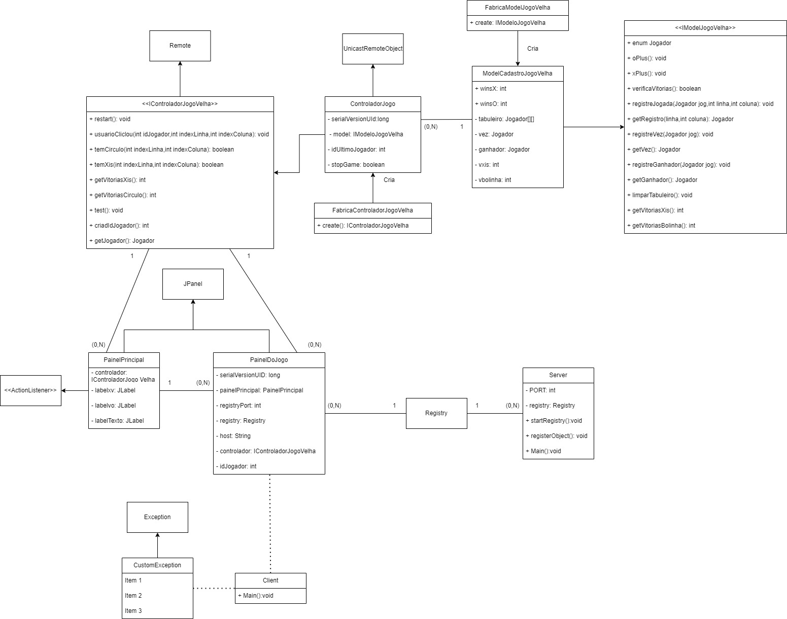

# Como foi estruturada a solução do sistema distribuído.

## Diagrama de Classes



## Explicação

A linguagem de programação utilizada foi o Java, se utilizando do RMI como mecanismo utilizado para garantiar a transparência na comunicação dentro de um sistema distribuído, os mecanismos do RMI que ajudaram na construção do jogo foram:

**Chamada de Métodos Remoto**: RMI permite que um programa Java em uma JVM chame métodos de objetos localizados em uma JVM remota. Isso é feito de forma transparente, como se o objeto remoto estivesse local.

>Assim como quando o Cliente instancia o PainelDoJogo, onde o mesmo vai acionar o ControladorJogoVelha que herda de uma objeto *Remote*

```java
	private static void painelJogo() throws Exception {
		try {
			JFrame frame = new JFrame();
			
			JPanel painel = new PainelDoJogo();
			frame.setContentPane(painel);
			
			frame.setDefaultCloseOperation(JFrame.EXIT_ON_CLOSE);
			frame.setSize(500, 500);
			frame.setResizable(false);
			frame.setVisible(true);

		} catch (RemoteException e) {
			throw new CustomException("Erro no objeto remoto");
		}
	}
```
Caminho no código

```
\jogo-da-velha-rmi-java\src\jogo\rmi\Client.java
```


**Interfaces Java**: RMI baseia-se fortemente em interfaces Java. Para expor um objeto para acesso remoto, você define uma interface que estende a interface especial *Remote*. Todos os métodos que podem ser chamados remotamente devem ser declarados na interface remota.

>Assim como em:

```java
public interface IControladorJogoVelha extends Remote {

	public void restart() throws RemoteException;

	public void usuarioClicou(int idJogador, int indexLinha, int indexColuna) throws RemoteException;
	
	public boolean temCirculo(int indexLinha, int indexColuna) throws RemoteException;
	
	public boolean temXis(int indexLinha, int indexColuna) throws RemoteException;

	public int getVitoriasXis() throws RemoteException;

	public int getVitoriasCirculo() throws RemoteException;

	void teste() throws RemoteException;
	
	// Cria um identificador para o jogador conectado
    public int criarIdJogador() throws RemoteException;
    
    public Jogador getJogador() throws RemoteException;

}

```

```
\jogo-da-velha-rmi-java\src\jogo\controler\IControladorJogoVelha.java
```


**Objetos Remotos**: Os objetos que desejamos acessar remotamente devem implementar a interface remota. Isso envolve estender a classe 

```java
java.rmi.server.UnicastRemoteObject
```

e fornecer um construtor que lança uma exceção *RemoteException*.

>Assim como no ControladorJogo que vai chamar/controlar as funções do jogo da velha de forma remota: 

```java
public class ControladorJogo extends UnicastRemoteObject implements IControladorJogoVelha 
```

Caminho no código

```
\jogo-da-velha-rmi-java\src\jogo\controler\ControladorJogo.java
```


**Registro de Objetos RMI**: Para que os clientes possam localizar objetos remotos, é necessário registrá-los em um serviço de registro RMI. O serviço de registro age como um diretório de objetos remotos, permitindo que os clientes encontrem referências para esses objetos.

> Assim como em:

```java
public class Server {

    private static final int PORT = 1099;
    private static Registry registry;

    // Inicia registro do Server
    public static void startRegistry() throws RemoteException {
        registry = java.rmi.registry.LocateRegistry.createRegistry(PORT);
    }

    // Registra objeto do Server
    public static void registerObject(String name, Remote remoteObj) throws RemoteException, AlreadyBoundException {
        registry.bind(name, remoteObj);
        
    }
    
	
	public static void main(String[] args) throws Exception {
        startRegistry();
        registerObject(IControladorJogoVelha.class.getSimpleName(), new ControladorJogo());
        // Mensagem que confirma inicialização do servidor
        System.out.println("Servidor iniciado com sucesos. Aguardando conexão.");
		
	}

}
```

Caminho no código

```
\jogo-da-velha-rmi-java\src\jogo\rmi\Server.java
```

**Segurança**: RMI inclui recursos de segurança para proteger a comunicação entre objetos remotos. Ele oferece autenticação e autorização para garantir que apenas clientes autorizados acessem os objetos remotos.

---