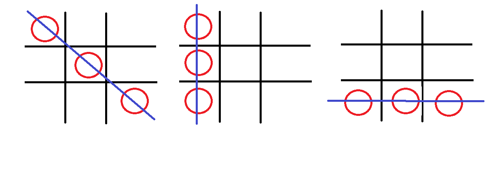

# Descrição do Jogo

É a recriação do clássico jogo da velha, onde temos o jogador **1** que é a **bolinha** e o jogador **2** que é a **cruz** dentro de um tabuleiro de tralha.

## Condição de vitória

Ganha o jogador que conseguir fazer 3 do seu simbolo em linha reta, segue algumas imagens para exemplificar.

## Jogadas Válidas ou Inválidas

A jogada só vai ser válida se a posição que o jogador escolher estiver vazia *e* for a vez do jogador jogar, senão a jogada se torna inválida. 

