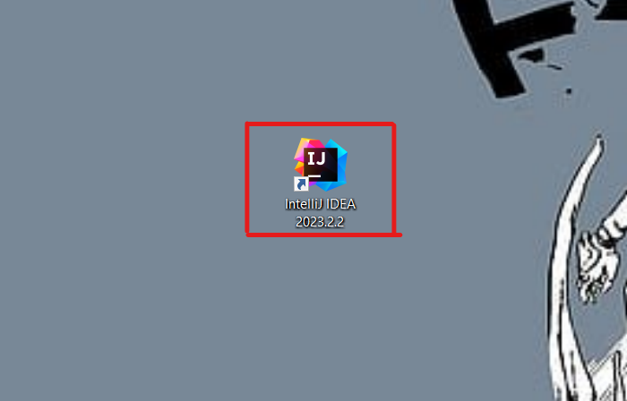
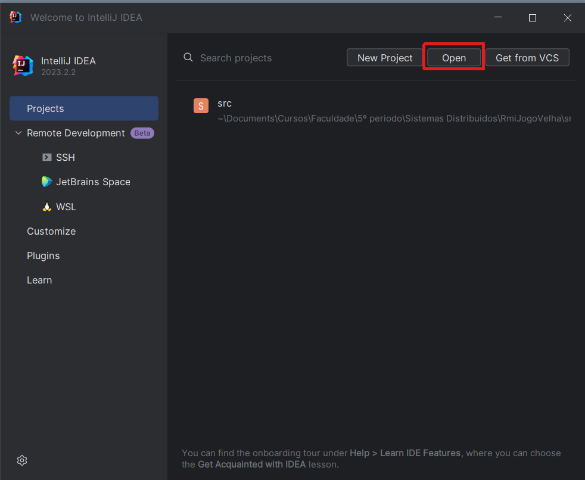
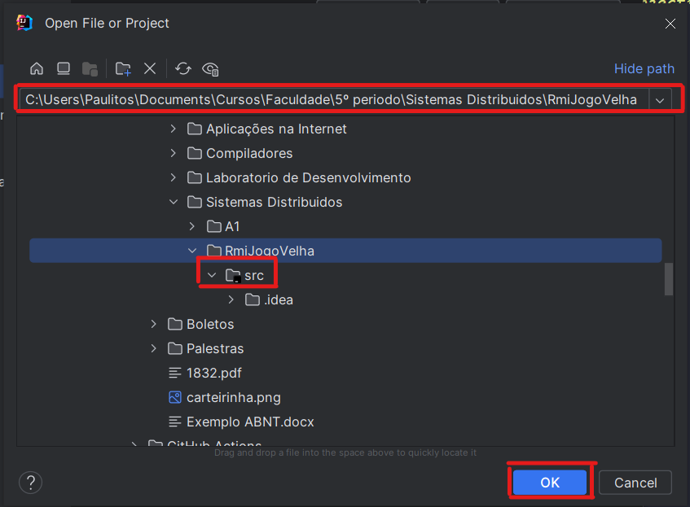
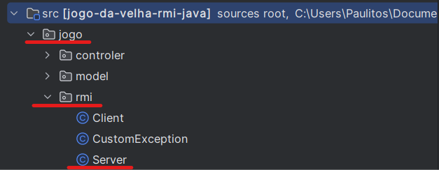
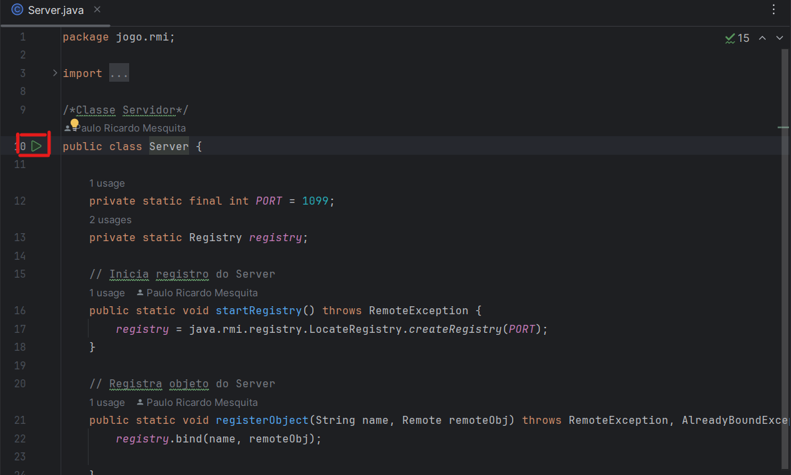
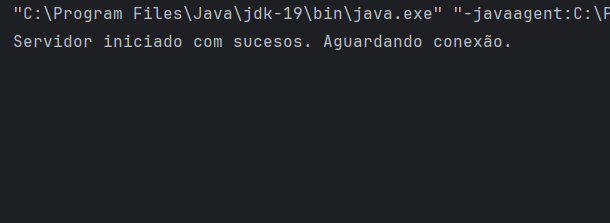
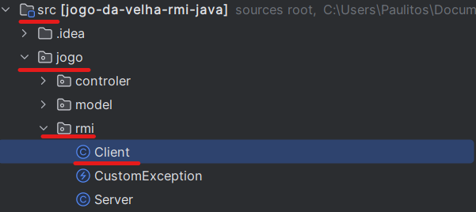
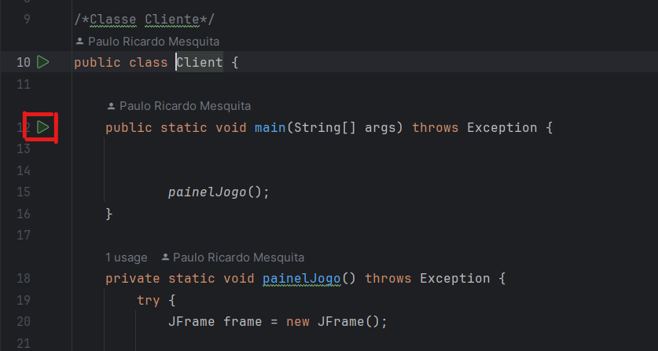
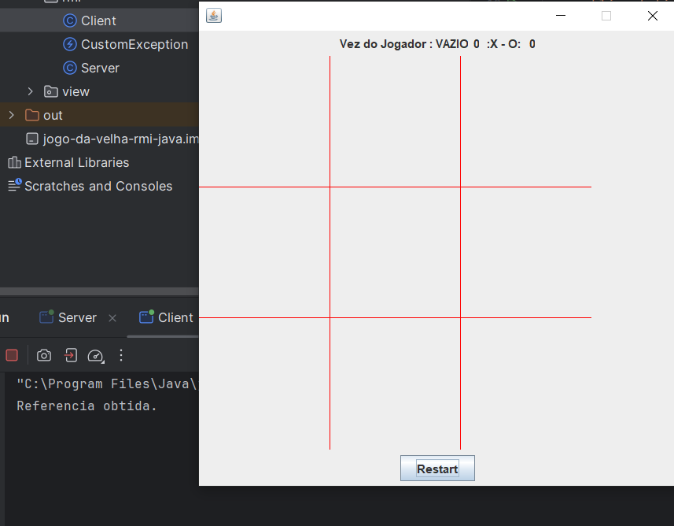

# Explicação de como compilar e executar o programa

> Necessario ter o Java 19 e o IntelliJ na sua máquina.

- Execute o *IntelliJ*



- Clique em *Open*



- Coloque no URL o *path*, clique na pasta *src* e por fim clique no botão *ok*.



## Executando o Servidor

_Path_ em:
```
\jogo-da-velha-rmi-java\src\jogo\rmi\Server.java
```

- Clique no arquivo do Servidor



- Clique no botão verde do metódo *Main*.



- Servidor iniciado com sucesso.



## Executando o Cliente

> Lembre-se de executar o servidor antes do cliente, para jogar tem que ter **2** clientes conectados no servidor.

- Clique no arquivo do Cliente

_Path_ em:
```
>\jogo-da-velha-rmi-java\src\jogo\rmi\Client.java
```



- Clique no botão verde do metódo *Main*.



- Jogo aberto com Sucesso



---